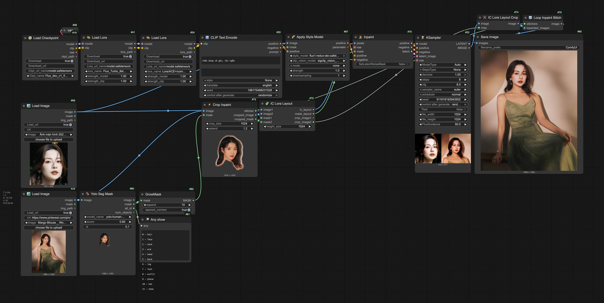
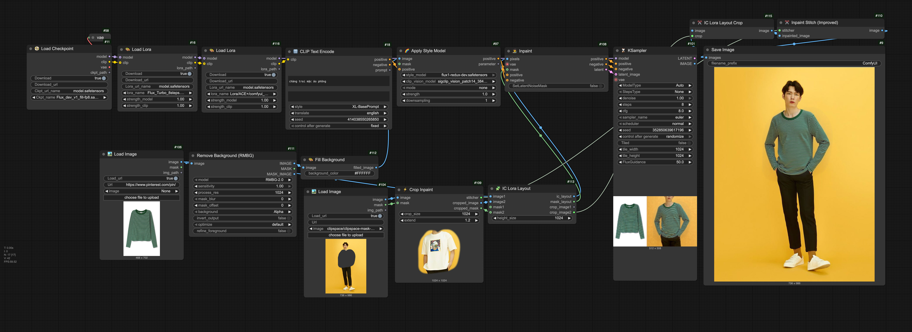

# SDVN Comfy Node
**Smart node set, supporting easier and more convenient ways to use ComfyUI**

   

___
[**Hướng dẫn tiếng việt**](/README_vi.md)

[**Installing**](#Install)

[**Guide**](#Guide)
- [✨ Base Node](#BaseNode)
- [🏞️ Image](#Image)
- [📥 Download](#Download)
- [🧬 Merge](#Merge)
- [💡 Creative](#Creative)
- [👨🏻‍💻 Dev](#Dev)
- [💬 API](#API)
- [ℹ️ Info_check](#Info_check)
- [✨ Preset](#Preset)
- [🎭 Mask](#Mask)

[**Example**](#Example)

___
# Todo

- [x] Workflow Example
- [x] Guide
- [x] Install
___

# Install

Install with simple commands: 
- `cd <ComfyUI folder path>/custom_nodes`
- `git clone https://github.com/StableDiffusionVN/SDVN_Comfy_node`
- *For Windows or macOS machines, users are required to manually install `aria2c` in order to use nodes that automatically download models.*

Also you should install the following nodes to be able to use all functions:
- [Dynamicprompts](https://github.com/adieyal/comfyui-dynamicprompts)
- [Inpaint crop](https://github.com/lquesada/ComfyUI-Inpaint-CropAndStitch)
- [TiledDiffusion](https://github.com/shiimizu/ComfyUI-TiledDiffusion)
- [IPAdapter_plus](https://github.com/cubiq/ComfyUI_IPAdapter_plus)
- [Controlnet_aux](https://github.com/Fannovel16/comfyui_controlnet_aux)
___

# Guide

- **For all nodes with download:** Supports direct download from **civitai** and **huggingface** with model address link and model download link
- **For all dodes load photos with the URL:** Automatically download photos to the url of the image. Can automatically search for the highest quality image with the [Pinterest link](https://www.pinterest.com/) . See also the [support list](https://github.com/mikf/gallery-dl/blob/master/docs/supportedsites.md)
- **For all nodes capable of entering the text:** Support **Google Translate** and [**Dynamic Prompt function**](https://github.com/adieyal/sd-dynamic-prompts/blob/main/docs/SYNTAX.md) (Request installed node [Dynamicprompts](https://github.com/adieyal/comfyui-dynamicprompts))
___
### BaseNode
*A collection of smart nodes that replace basic tasks, helping users build processes smarter and faster*

**📀 Load checkpoint / 🎨 Load Lora**

 Supports 2 methods of loading checkpoint and downloading checkpoint directly for use.
 - If you leave the Download_url information, checkpoint will be selected according to the Ckpt_name
 - If you enter the checkpoint download url and leave the Download - True option, the checkpoint will be downloaded to checkpoints/loras folder and named Ckpt_url_name

Additionally, these two nodes support a curated list of commonly used checkpoints and LoRAs. If the models are not already available in the folder, they will be automatically downloaded.

**🏞️ Load Image / 🏞️ Load Image Url**

- Support 2 images download methods from input folders and URL links / Image Path
- Support sub-folders in the input folder

**🏞️ Load Image Folder**

- Load a list with number images from a folder.
- If random = True, the images will be completely random; otherwise, they will be a sequence of images that are adjacent to each other.
- If `number < 1`, the entire folder of images will be loaded.

**🏞️ Load Pinterest**

Automatically search and download images from Pinterest. Images will be automatically downloaded to the input folder, organized into separate subfolders.

- Url:
  -	Accepts any Pinterest image link (single image, board, board section, or profile page) (e.g., https://www.pinterest.com/...). If the link starts with a slash /, the prefix https://www.pinterest.com will be automatically added (e.g., /abc/vintage ⇨ https://www.pinterest.com/abc/vintage).
  
  - Accepts any keyword and will automatically search for images on Pinterest using that keyword.
- Range: Location – Number of images that will be downloaded to the input folder.
- Number: The number of images that will be loaded and returned. If random = True, the images will be randomly selected from the downloaded list; otherwise, the images will be selected based on their position determined by the seed.

**🏞️ Load Image Ultimate**

This is a powerful node that combines 5 different loading modes (Input Folder, Custom Folder, Pinterest, Insta, URL) to enhance flexibility in workflows. The options will automatically adjust based on the selected mode, and the usage is similar to the corresponding image loading nodes above.

**🔡 CLIP Text Encode**

- Simultaneously support both Positive, Negative
- Support Random ability with Dynamic Prompt (Request installed node [Dynamicprompts](https://github.com/adieyal/comfyui-dynamicprompts))
- Support Translate function
- Support Style Card.

**🗂️ Prompt Styles**

- Supports easier prompt writing with pre-saved and curated style presets.
- You can add or edit style cards by renaming and modifying the file my_styles.csv.example to my_styles.csv.

**🎚️ Controlnet Apply**

Provide full option to use ControlNet in a single node (Request installed node [Controlnet Aux](https://github.com/Fannovel16/comfyui_controlnet_aux))
- Can choose Controlnet Model, Preprocessor (Automatically detect Aux Preprocessor Aux Preprocessor + Add Invert Image option), Union Type
- Show preview pictures Preprocessor when running
- Supports automatic downloading of most popular ControlNet models for SD15, SDXL, and Flux.
- Supports direct usage with ControlNet Inpaint Alimama Flux.
- Supports exporting parameters for integration with the AutoGenerate node.

**🌈 Apply Style Model**

-	Supports automatic downloading of style and CLIP models
-	Supports working with masks, downsampling, and various crop modes (Note: these features may not work well with Redux 512). (See more in Redux Adv: https://github.com/kaibioinfo/ComfyUI_AdvancedRefluxControl)

**⏳ Ksampler**

Smart node with many quick options to support flexibly in many different cases, help minimize errors and more flexibility to use.
- Convert 2 options for **negative** and **latent** to optional.
  - Without Negative, an empty clip will be replaced, now the way to connect to Flux will be in accordance with its nature - is not to use Negative
  - Without Latent, an empty Latent image will be created according to the size of Tile Width and Tile Height
- **ModelType:** Automatically adjust **CFG, Sampler name, Scheduler** for different types of models (SD15, SDXL, SDXL lightning, SDXL hyper, Flux ...). Now it is not a headache when it is too much.
- **StepsType:** Automatically adjust Steps according to the model and by Denoise ( Steps = Standing Steps x Denoise). Helps optimize the accurate and fastest process
- **Tiled:** Automatically divide the tiled block by mixture of differenters to minimize GPU when running Ksampler, applied in case of large image size and baby denoise (Request installed node [TiledDiffusion](https://github.com/shiimizu/ComfyUI-TiledDiffusion)). In case there is no latent, size tile = tile_width/2, tile_height/2
- Support FluxGuidance

**👨‍🎨 Inpaint**

A comprehensive Inpaint support, consolidated from 4 Node Vae Encode, Latent Noise Mask, Vae Encode (For Inpainting), InpaintModelCondinging
- Vae Encode: If Mask = None
- Vae Encode (For Inpainting): If Postive or Negative = None
- Latent Noise Mask: If SetLatentNoiseMask = True
- InpaintModelCondinging: If SetLatentNoiseMask = False, all Image, Vae, Postive, Negative

___

### Image
*Smart node set, support for handling imaging tasks*

**↗️ Upscale Image**

Smart Resize and Scale image
- Maxsize mode: Automatically calculate and adjust the image size so as not to change the ratio and do not exceed the required size
- Resize mode: Automatically resize the required size
- Scale mode: Calculate the image size according to the *scale index
- Model_name options will use Model Upscale according to the option, helping to keep more details when upscale
- Supports automatic downloading of popular upscale models.
  
**↗️ Upscale Latent**

Similar to Upscale Image, but will add Vae Decoder and Vae Encoder to process Latent images, helping the process more neat.

**🔄 Image List**

Combine individual images into a list image

**🔄 Image Repeat**

Repeat an image to create a list.

**📁 Image From List**

Filter out a single image from the list at the specified index.

**🪄 Film Grain / 🪄 HSL Adjust / 🪄 Image Adjust / 🪄 White Balance**

Nodes for adjusting lighting, colors, and applying effects to images.

**🔄 Flip Image**

Flip the image horizontally or vertically.

**🎨 Fill Background**

Fill the transparent areas of an image (with an alpha channel) with a solid color.

**🧩 IC Lora Layout | ✂️ IC Lora Layout Crop**

A set of nodes that supports layout creation and image cropping/splitting when used with IC Lora

**🪄 Image Layout**

A node that intelligently arranges image layouts with various flexible modes, helping to create clearer previews within the workflow

___

### Download

*The set of nodes supports downloading photos of models to the corresponding folder and directly used on Comfyui*
-  Supports direct download from **civitai** and **huggingface** with model address link and model download link
-  Additionally, some nodes provide a list of popular models to make downloading them more convenient and faster.
 

___

### Merge

*Supports the smart and convenient way to adjust the Weight Model Block Model compared to the original nodes, inspiring more creativity. Refer more information at [SuperMerge](https://github.com/hako-mikan/sd-webui-supermerger), [Lora Block Weight](https://github.com/hako-mikan/sd-webui-lora-block-weight)*

Support 3 types of syntax to adjust for each block
- The non -listed values ​​will take the last block value
- {Block}: {Weight Block}
  - Ex: SD15 has 12 blocks IN from 0-11 
    - `0:1, 1:1, 2:1, 3:1, 4:0, 5:1` <=> `0:1, 1:1, 2:1, 3:1, 4:0, 5:1, 6:1, 7:1, 8:1, 9:1, 10:1, 11:1`
    - `2:0, 3:1` <=> `0:1, 1:1, 2:0, 3:1, 4:1, 5:1, 6:1, 7:1, 8:1, 9:1, 10:1, 11:1`
- {Weight Block}
  - Ex: SDXL has 9 blocks IN from 0-8
    - `0, 0, 0, 0, 1, 1`  <=> `0:0, 1:0, 2:0, 3:0, 4:1, 5:1, 6:1, 7:1, 8:1`
- {Range}: {Weight Block}
  - Ex: Flux has 19 double blocks from 0-18
    - `0-10:0, 11-18:1` <=> `0:0, 1:0, 2:0, 3:0, 4:0, 5:0, 6:0, 7:0, 8:0, 9:0, 10:0, 11:1, 12:1, 13:1, 14:1, 15:1, 16:1, 17:1, 18:1`
- Combining 3 types of syntax
  - Ex: SDXL has 9 blocks OUT from 0-8
    - `0-3:0, 1, 6:1, 0` <=> `0:0, 1:0, 2:0, 3:0, 4:1, 5:0, 6:1, 7:0, 8:0`

**🧬 Model Merge**

- This node supports merging 2 or 3 checkpoints, extracting LoRA from 2 checkpoints — similar to the merge function in Automatic1111.

[*See more workflow examples*](#Example)

___

### Creative

The node set helps to create the process in a smart way

**📊 IPAdapter weight**

- Use the same syntax as the merge
  
**🔃 Translate**

- Support translate and Dynamic prompt

**🔎 Any show**

- A smart and flexible node that supports displaying any type of data, including image, string, int, float, bool, mask, and JSON.

**⚡️ Run test**

- A simple node used for testing workflows without returning any output.

**🔡 Any Input Type**

- Support Math, Boolean input value (yes-no, true-false, 1-2)
- Support output list
- A powerful and flexible node for working with text or numbers, supporting various output modes. You can easily concatenate multiple text segments using representative keywords like in1, in2, in3.

**🔡 Simple Any Input**

- A simpler version of Any Input Type — this node automatically converts input strings into STRING, FLOAT, INT, or BOOL formats. Commas (,) in the input string will act as separators, splitting the string into multiple parts and returning them as a list.

**📐 Image Size**

- A smart node for retrieving the width and height of an image (latent image). Additionally, you can define a maximum size using the maxsize value — the dimensions will not exceed this value and the aspect ratio will be preserved, If maxsize = 0, the image will retain its original dimensions.

**🔢 Seed**

- A node that supports INT input with options for randomization and variable adjustment, making it suitable for automated workflows.

**🔄 Switch | #️⃣ Boolean | #️⃣ Logic Switch | 🔄 Auto Switch**

  - A set of nodes that support flow-switching options, helping to automate workflows.

**🪢 Pipe In | 🪢 Pipe Out | 🪢 Pipe Out All**

- Nodes that help simplify, organize, and visually clean up the connections in your workflow.

**🔄 Any Repeat | 🔄 Any List**

- A node that converts simple data items into a list.

**⚖️ Filter List | 📁 Any From List**

- Filter data within a list.
  
Example: A workflow to filter images with a width ≥ 1000px.

**💽 Load Text | 💽 Save Text**

- A set of nodes that support handling .txt files, including reading, saving, and editing text files.
- The 💽 Load Text node has three text loading methods in order of priority: external string input, custom .txt path, and .txt files from the input folder.

**📋 Load Google Sheet**

- A node that supports reading data from publicly shared Google Sheets.

**📋 Menu Option | 🔄 Dic Convert**

- Nodes that support creating automated options and dynamically changing variables based on input.

___

### API

Support the use of AI models through API
- Support the default API setting through the file: `.../SDVN_Custom_node/API_key.json` (Rename API_key.json.example and fill API)
  - Get Gemini API: https://aistudio.google.com/app/apikey
  - Get HuggingFace API: https://huggingface.co/settings/tokens
  - Get OpenAI API (Chat GPT, Dall-E): https://platform.openai.com/settings/organization/api-keys
  - Get Deepseek API: https://platform.deepseek.com/api_keys

**💬 Chatbot**
- Image: Suport Gemini, ChatGPT
- Preset: Add history and sample statements in cases of each other
- Support translate and Dynamic prompt

**🎨 DALL-E 2 | 🎨 DALL-E 3 | 🎨 GPT Image**

- Support translate and Dynamic prompt

**🎨 Gemini Flash 2 Image | 🎨 Google Imagen**

**✨ IC-Light v2 | ✨ Joy Caption**

A node that uses the Hugging Face API to directly interact with corresponding Spaces.
 - IC-Light v2: https://huggingface.co/spaces/lllyasviel/iclight-v2
 - Joy Caption: https://huggingface.co/spaces/fancyfeast/joy-caption-alpha-two

___

# Info check

A set of nodes that support reading image and model metadata, editing model information, and generating illustrative cover images.

**ℹ️ Lora info | Model info editor**

Read and display information of LoRA and checkpoint models, as well as edit metadata within these models.

**ℹ️ Image Info| ℹ️ Exif check | ℹ️ Metadata check**

Nodes that support reading any embedded metadata within images.

___

# Preset

Nodes that help simplify the process of building workflows. Nodes designed around the `💡 Auto Generate` node to streamline workflows.

**💡 Auto Generate**

- The node will automatically generate images and calculate parameters to ensure the generation is as fast and accurate as possible.
- Automatically selects KSampler, Scheduler, and CFG based on the input model (SD15, SDXL, Flux). For SDXL, if steps = 8, parameters will be adjusted according to SDXL Lightning. Users can manually choose KSampler, Scheduler, and CFG via the AdvSetting option.
- Automatically splits image segments and creates an upscale–hires fix workflow based on the model and image generation size. Users can manually select the upscale model via the AdvSetting option.
- Automatically detects the language and translates the Prompt / Negative Prompt into English.
- The prompt and negative prompt sections support dynamic prompts. (When Random_prompt = True and used with a list, the returned results will vary each time).
- Automatically switches to an img2img or inpaint process when an input image or mask is provided. If the input model is an inpaint/fill model, set inpaint_model = True to automatically apply optimal parameters. Image size will automatically adjust to maintain the aspect ratio of the input image.
- Add ControlNet and ApplyStyle settings via parameters using the `🎚️ Controlnet Apply` and `🌈 Apply Style Model` nodes. Multiple parameters can be added at once by using the `🔄 Join Parameter` node.
- Steps will be automatically recalculated based on the denoise value, using the formula: `Step = Steps × Denoise`.

___

# Mask

Nodes that support both basic and advanced mask processing and inpainting.

**🎭 Yolo Seg Mask**

- A node that uses YOLO models to automatically detect masks accurately, quickly, and with minimal GPU usage.

**🧩 Mask Regions**

- This node separates distinct masked areas into individual masks, working exceptionally well with the inpaint crop node set.

**⚡️ Crop Inpaint | 🔄 Loop Inpaint Stitch**

- These 2 nodes are built based on the (https://github.com/lquesada/ComfyUI-Inpaint-CropAndStitch) node set, and you need to install that set first in order to use them.
- The Loop Inpaint Stitch node is used to iteratively inpaint multiple regions when the input is a list. It stitches the results together and returns a single image, ideal for inpainting multiple areas in one pass.

___

# Example

___

**Copyright**

- [Stable Diffusion VN](https://stablediffusion.vn/)
- [Group SDVN](https://www.facebook.com/groups/stablediffusion.vn)
- [Comfy.vn](https://comfy.vn/)
- [SDVN.ME](https://sdvn.me/)
- [fluxai.vn](https://colab.research.google.com/github/StableDiffusionVN/SDVN-WebUI/blob/main/SDVN_ComfyUI_Flux_v3.ipynb)

**Course**
- [hungdiffusion.com](https://hungdiffusion.com/)